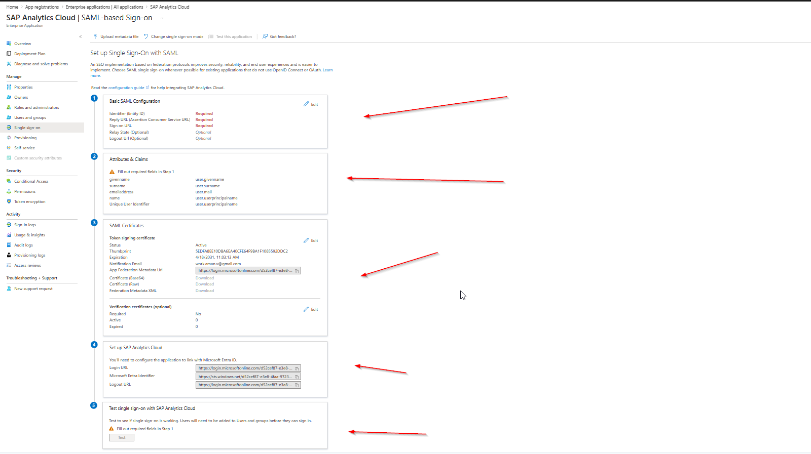

# 🔐 Microsoft Entra ID — Authentication Flows & SAML SSO Deep Dive

> A comprehensive reference guide covering all major OAuth 2.0 / OpenID Connect authentication flows in Microsoft Entra ID (formerly Azure AD), plus a detailed walkthrough of SAML-based Single Sign-On configuration for enterprise applications like SAP Analytics Cloud.


## 📚 Table of Contents

- [Authentication Flows](#-authentication-flows)
  - [Authorization Code Flow](#1-authorization-code-flow)
  - [Authorization Code + PKCE](#2-authorization-code--pkce)
  - [Client Credentials Flow](#3-client-credentials-flow)
  - [Device Code Flow](#4-device-code-flow)
  - [On-Behalf-Of (OBO) Flow](#5-on-behalf-of-obo-flow)
  - [Hybrid Flow](#6-hybrid-flow)
  - [Implicit Flow (Legacy)](#7-implicit-flow-legacy)
  - [ROPC (Legacy)](#8-resource-owner-password-credentials-ropc)
- [SAML-Based SSO](#-saml-based-sso)
  - [How SAML Works](#how-saml-works)
  - [Basic SAML Configuration](#basic-saml-configuration)
  - [Attributes & Claims](#attributes--claims)
  - [SAML Certificates](#saml-certificates)
  - [SSO Modes Comparison](#sso-modes-comparison)
- [Quick Reference](#-quick-reference)
- [Troubleshooting](#-troubleshooting)

---

## 🔄 Authentication Flows

### 1. Authorization Code Flow

**Best for:** Web apps with a server-side backend (ASP.NET, Django, Spring Boot).

```
User → App → Entra ID (authenticate) → Auth Code → App Server → Token Exchange → Access Token
```

| Property | Value |
|---|---|
| Client type | Confidential (has client secret) |
| User involvement | Yes |
| MFA / Conditional Access | Yes |
| Refresh token | Yes |
| PKCE recommended | Yes |

**Key steps:**
1. App redirects user to `/authorize?response_type=code&client_id=...`
2. User authenticates with full Entra ID (MFA, CA policies)
3. Auth code returned to `redirect_uri`
4. Server exchanges code + `client_secret` for tokens via back-channel POST
5. Access token used to call downstream APIs

---

### 2. Authorization Code + PKCE

**Best for:** SPAs (React, Angular, Vue), mobile apps, desktop apps — any public client that cannot safely store a secret.

```
App generates code_verifier + code_challenge
→ Redirect with code_challenge
→ Auth code returned
→ Token exchange with code_verifier (no secret needed)
```

| Property | Value |
|---|---|
| Client type | Public (no client secret) |
| User involvement | Yes |
| MFA / Conditional Access | Yes |
| Refresh token | Yes |
| Protects against | Authorization code interception |

```js
// Generate PKCE pair
const codeVerifier = generateRandomString(64);
const codeChallenge = base64url(sha256(codeVerifier));

// Step 1: Redirect
GET /authorize?response_type=code
  &code_challenge=<codeChallenge>
  &code_challenge_method=S256

// Step 2: Exchange (no client_secret!)
POST /token
  code=<authCode>
  &code_verifier=<codeVerifier>
```

---

### 3. Client Credentials Flow

**Best for:** Daemons, background jobs, CI/CD pipelines, microservices — any machine-to-machine scenario with no user.

```
Service → POST credentials → Entra ID → Access Token → Call API
```

| Property | Value |
|---|---|
| Client type | Confidential |
| User involvement | **No** |
| MFA / Conditional Access | No (service identity) |
| Refresh token | **No** — re-authenticate when token expires |
| Permission type | Application permissions (not delegated) |

```http
POST /token
Content-Type: application/x-www-form-urlencoded

grant_type=client_credentials
&client_id=<appId>
&client_secret=<secret>          # or use certificate (preferred)
&scope=https://graph.microsoft.com/.default
```

> ⚠️ **Use certificates over secrets.** Client secrets can be leaked. A certificate assertion (`client_assertion`) keeps the private key on your server.

---

### 4. Device Code Flow

**Best for:** Devices with no browser — Azure CLI (`az login`), VS Code Remote SSH, IoT devices, smart TVs, kiosks.

```
Device → Request device_code + user_code
→ Display "Visit aka.ms/devicelogin, enter: ABCD-1234"
→ Device polls token endpoint
→ User signs in on separate device
→ Tokens issued to original device
```


| Property | Value |
|---|---|
| Client type | Public |
| User involvement | Yes (on a secondary device) |
| MFA / Conditional Access | Yes |
| Refresh token | Yes |
| Code expiry | ~15 minutes |

```http
# Step 1: Request codes
POST /devicecode
client_id=<appId>&scope=openid profile

# Response
{
  "user_code": "ABCD-1234",
  "verification_uri": "https://microsoft.com/devicelogin",
  "expires_in": 900,
  "interval": 5
}

# Step 2: Poll until user completes sign-in
POST /token
grant_type=urn:ietf:params:oauth:grant-type:device_code
&device_code=<deviceCode>
```

---

### 5. On-Behalf-Of (OBO) Flow

**Best for:** Microservice chains — API A needs to call API B while preserving the original user's identity.

```
User → Client App → [token for API A] → API A
                                          ↓ OBO exchange
                                     Entra ID issues token for API B
                                          ↓
                                        API B (sees original user)
```

| Property | Value |
|---|---|
| User involvement | Yes (original user's identity flows through) |
| MFA / Conditional Access | Evaluated at original login |
| Refresh token | Yes |
| Token caching | Critical — cache by user to avoid throttling |

```http
POST /token
grant_type=urn:ietf:params:oauth:grant-type:jwt-bearer
&assertion=<incoming_access_token>
&requested_token_use=on_behalf_of
&scope=<API_B_scope>
&client_id=<API_A_client_id>
&client_secret=<API_A_secret>
```

---

### 6. Hybrid Flow

**Best for:** Classic ASP.NET apps using OWIN / OpenID Connect middleware that need the `id_token` immediately in the browser.

```
GET /authorize?response_type=code+id_token&nonce=...
→ Returns: id_token in fragment (immediate) + code in query string (for back-channel exchange)
```

> ⚠️ Always validate the `nonce` claim in the `id_token` to prevent replay attacks.

---

### 7. Implicit Flow (Legacy)

> ❌ **Deprecated. Do not use for new apps.** Migrate to Authorization Code + PKCE.

Tokens are returned in the URL fragment (`#access_token=...`), visible in browser history and accessible to any script on the page.

**Migration path:** Update `response_type=code`, add PKCE, use MSAL.js 2.x which uses PKCE by default.

---

### 8. Resource Owner Password Credentials (ROPC)

> ❌ **Strongly avoid.** Cannot handle MFA, Conditional Access, or federated identity. Most enterprise tenants block this via CA policies.

Only acceptable for legacy automated test pipelines where no alternative exists.

---

## 🔑 SAML-Based SSO

### How SAML Works

SAML 2.0 is an XML-based federation protocol. Entra ID acts as the **Identity Provider (IdP)** and the target application (e.g. SAP Analytics Cloud) is the **Service Provider (SP)**.

#### SP-Initiated Flow (most common)

```
User → Visits SAP → SAP builds AuthnRequest (XML, Base64)
     → Redirect to Entra ID Login URL
     → Entra ID authenticates user (MFA, CA policies)
     → HTTP POST SAML Response to ACS URL
     → SAP validates XML signature using Entra ID's cert
     → User session created in SAP
```

#### IdP-Initiated Flow

```
User → Clicks SAP tile in MyApps portal
     → Entra ID directly POSTs SAML assertion to SAP ACS URL
     → SAP validates and creates session
```

---

### Basic SAML Configuration



| Field | Required | Description |
|---|---|---|
| **Identifier (Entity ID)** | ✅ Yes | Unique URI identifying the SP to Entra ID. Copy from SAP's metadata file. |
| **Reply URL (ACS URL)** | ✅ Yes | HTTPS endpoint where Entra ID POSTs the SAML Response. Must match exactly. |
| **Sign on URL** | ✅ For SP-init | URL on SAP side that triggers the login flow. Used by the Test button. |
| **Relay State** | Optional | Passed through the flow; SAP can use it for deep-link redirects after login. |
| **Logout URL** | Optional | SAP's SLO endpoint. Without this, signing out of Entra ID won't log user out of SAP. |

```
Entity ID example:   https://<sap-host>/saml2/metadata
ACS URL example:     https://<sap-tenant>.eu10.hanacloudservices.cloud.sap/saml/acs
Sign on URL example: https://<sap-tenant>.hanacloudservices.cloud.sap/
```

---

### Attributes & Claims


Default claims sent in the SAML assertion:

| Claim name | Entra ID source | Purpose |
|---|---|---|
| `givenname` | `user.givenname` | User's first name |
| `surname` | `user.surname` | User's last name |
| `emailaddress` | `user.mail` | Primary email |
| `name` | `user.userprincipalname` | Display name / UPN |
| **Unique User Identifier** | `user.userprincipalname` | **Primary key — must match SAP's user store** |

**Common attribute sources:**

| Source | Use case |
|---|---|
| `user.userprincipalname` | Default — cloud-only accounts |
| `user.mail` | When email differs from UPN (hybrid) |
| `user.objectid` | Immutable GUID — best for long-term stability |
| `user.onpremisessamaccountname` | Hybrid AD environments |
| `user.extensionattribute1–15` | Custom data (cost center, business unit) |

> ⚠️ **Most common issue:** If SAP can't find the user after login, the Unique User Identifier doesn't match the user ID format in SAP. Use the SAML-tracer browser extension to inspect the raw assertion.

---

### SAML Certificates


The certificate lets SAP verify that assertions genuinely came from Entra ID. Entra ID signs the XML with its **private key**; SAP verifies using Entra ID's **public certificate**.

| Download format | Use |
|---|---|
| Certificate (Base64) | Paste into SAP trust configuration (most common) |
| Certificate (Raw) | DER binary — for older SAP versions |
| Federation Metadata XML | Upload to SAP if supported — contains cert + URLs |
| App Federation Metadata URL | Auto-update endpoint — SAP can poll this to auto-rotate |

> 🚨 **Certificate expiry = instant outage for all SAML logins.** 
> - Set the notification email in Entra ID
> - Calendar a rollover 30+ days before expiry
> - Pre-stage new cert as "inactive" → update SAP → flip to "active" for zero-downtime rotation

---

### SSO Modes Comparison

| Mode | Real SSO | Use case |
|---|---|---|
| **SAML-based SSO** | ✅ Full federation | Enterprise apps — SAP, Salesforce, ServiceNow |
| **OpenID Connect / OAuth 2.0** | ✅ Full federation | Modern cloud-native apps (JWT-based) |
| **Linked** | ❌ No auth | Surface external URLs in MyApps — app already uses another IdP |
| **Password-based SSO** | ⚠️ Weak | Legacy apps with no federation support (Entra ID fills username/password) |
| **Integrated Windows Auth** | ✅ Kerberos | On-prem apps via Application Proxy (hybrid) |
| **Header-based SSO** | ✅ Via proxy | Legacy Unix/Linux apps via Application Proxy |
| **Disabled** | ❌ Off | Default state; use during initial setup |

> 💡 **When to use Linked:** Your app is already federated with a different IdP (Okta, ADFS) but you want it to appear in the Entra ID MyApps portal without interfering with existing federation.

---

## ⚡ Quick Reference

### Which flow should I use?

```
Is there a logged-in user?
├── Yes
│   ├── App has a server backend?       → Authorization Code (+ PKCE)
│   ├── SPA or mobile app?              → Authorization Code + PKCE
│   ├── Device with no browser?         → Device Code Flow
│   ├── API calling another API?        → On-Behalf-Of (OBO)
│   └── Legacy app (do not use)?        → Implicit / ROPC
└── No (machine-to-machine)
    └── Service / daemon / job?         → Client Credentials
```

### Token types

| Token | Purpose | Audience |
|---|---|---|
| `id_token` (JWT) | Identifies WHO the user is | Your app only — never send to an API |
| `access_token` (JWT) | Grants access to an API | The target API |
| `refresh_token` (opaque) | Gets a new access token silently | Entra ID token endpoint |

---

## 🛠 Troubleshooting

### SAML

| Error | Cause | Fix |
|---|---|---|
| `AADSTS50011` — reply URL mismatch | ACS URL in Entra ID ≠ what SAP sends | Ensure exact match including trailing slash |
| `AADSTS650056` — misconfigured app | Admin consent not granted | Grant admin consent in API Permissions |
| `InvalidNameIDPolicy` | NameID format mismatch | Align NameID format between Entra ID and SAP config |
| User not found in SAP | UPI claim doesn't match SAP user store | Use SAML-tracer to inspect the assertion; fix the Unique User Identifier claim |
| All logins fail suddenly | Certificate expired | Rotate the signing certificate |

### OAuth / OIDC

| Error | Cause | Fix |
|---|---|---|
| `invalid_grant` | Auth code already used / expired | Codes are single-use and expire in ~10 min |
| `AADSTS70011` — invalid scope | Scope not registered on the API | Add the scope in App Registration → Expose an API |
| `AADSTS65001` — consent required | User/admin hasn't consented | Trigger admin consent flow or add to required permissions |
| `AADSTS50076` — MFA required | Conditional Access requires MFA | Complete MFA in the interactive flow; cannot be bypassed |

---

## 🔗 References

- [Microsoft Entra ID documentation](https://learn.microsoft.com/en-us/entra/identity/)
- [OAuth 2.0 / OIDC flows in Entra ID](https://learn.microsoft.com/en-us/entra/identity-platform/authentication-flows-app-scenarios)
- [SAML protocol reference](https://learn.microsoft.com/en-us/entra/identity-platform/saml-protocol-reference)
- [MSAL libraries](https://learn.microsoft.com/en-us/entra/identity-platform/msal-overview)
- [SAP Analytics Cloud SAML SSO guide](https://help.sap.com/docs/SAP_ANALYTICS_CLOUD)

---


---

*Last updated: June 2026 | Entra ID / Azure AD*